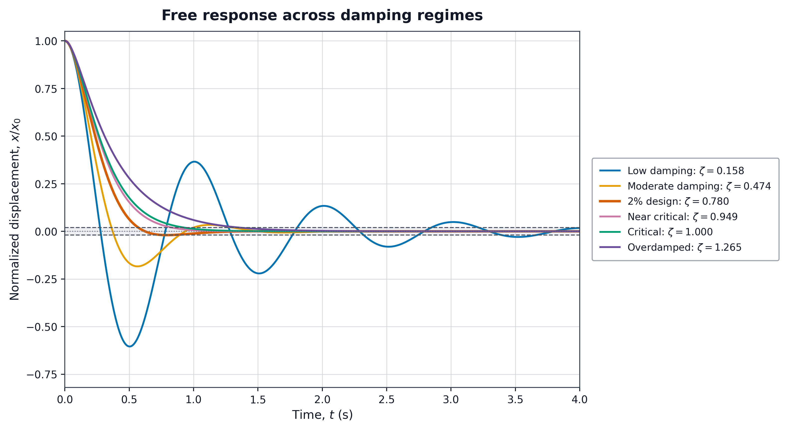
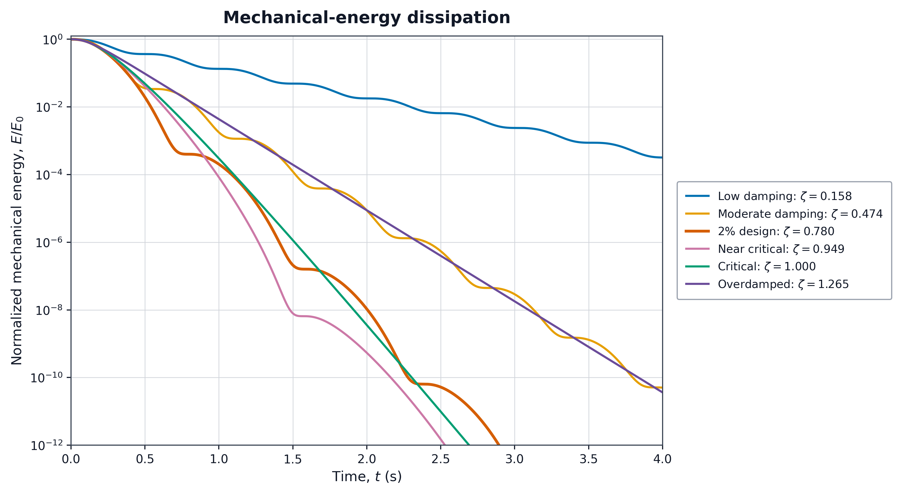
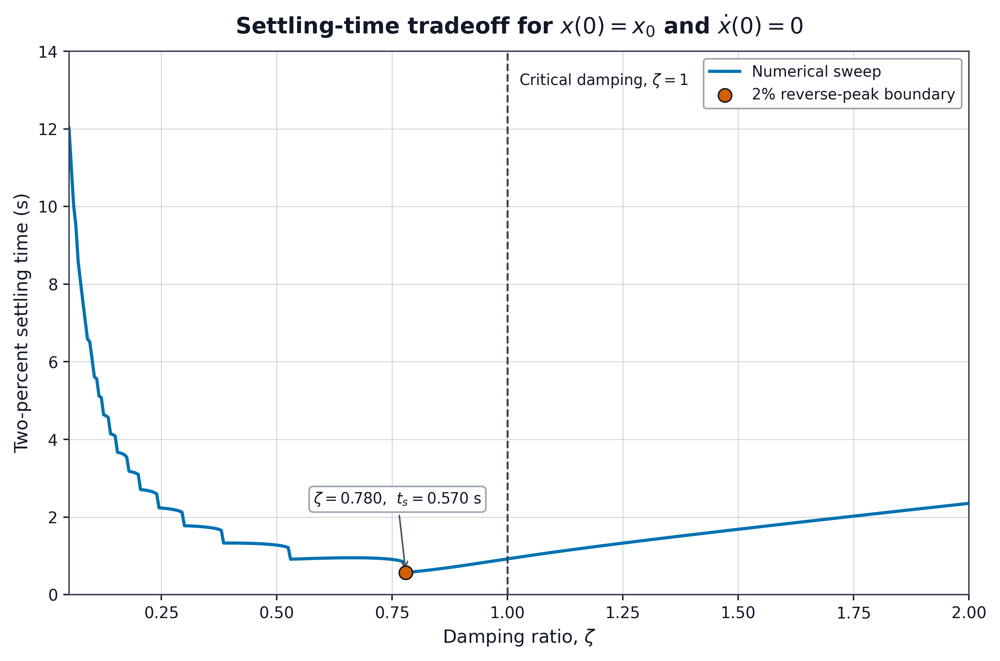

# SDOF Vibration and Damping Analysis

[](https://github.com/Isaac-A-S/sdof-vibration-analysis/actions/workflows/matlab.yml)

A MATLAB study of the free response of a linear mass–spring–damper system: derive the response, compare damping regimes, verify the implementation, and examine a 2% reverse-peak design requirement.

**Scope:** one translational degree of freedom, constant linear stiffness and viscous damping, and prescribed initial conditions. Parameters are illustrative. This is a numerical vibration study with no experimental calibration or aircraft-specific validation.



## Run the project

Clone or download and **extract** the repository. In MATLAB, set the Current Folder to the repository root (the folder containing this README), then run:

```matlab
run('tests/run_tests.m')
run('matlab/run_analysis.m')
```

The scripts use base MATLAB; Simulink and Control System Toolbox are not required. The automated workflow targets **MATLAB R2025b on Linux**. `exportgraphics` requires R2020a or later; other releases have not been systematically tested.

The analysis writes CSV results, PNG images, editable `.fig` files, and a run-environment record. To edit a generated figure in MATLAB:

```matlab
openfig('figures/free_response_comparison.fig')
```

The scripts clear workspace variables; the analysis also closes open figures. Save unrelated work first. The relative `run(...)` commands above must start at the repository root; pressing Run in the open script also works because internal output paths are based on the script location.

## Model and assumptions

$$m\ddot{x}+c\dot{x}+kx=0,\qquad x(0)=x_0,\quad\dot{x}(0)=v_0.$$

Here $x$ is displacement from static equilibrium. The spring force is $-kx$ and the damper force is $-c\dot{x}$. Constant weight is absorbed into the equilibrium position. There is no time-dependent forcing after release.

$$\omega_n=\sqrt{k/m},\qquad c_{\mathrm{crit}}=2\sqrt{km},\qquad \zeta=c/c_{\mathrm{crit}}.$$

| Input | Value | Meaning |
| --- | ---: | --- |
| $m$ | 1,000 kg | Lumped mass |
| $k$ | 40,000 N/m | Linear stiffness |
| $x_0$ | 0.50 m | Release displacement |
| $v_0$ | 0 m/s | Release from rest |
| $\omega_n$ | 6.3246 rad/s | Undamped natural frequency |
| $c_{\mathrm{crit}}$ | 12,649.1 N·s/m | Critical damping coefficient |

The model assumes a linear spring over the chosen displacement range; no actual geometry establishes that range here. The initial acceleration is $-20\ \mathrm{m/s^2}$ and the initial stored energy is 5,000 J. These are consequences of the illustrative inputs, not measured performance.

For $0\leq\zeta<1$, the characteristic roots are complex, producing decaying oscillation when $c>0$. Critical damping has a repeated real root; overdamping has two distinct negative real roots. Full initial-condition solutions, energy balance, nondimensionalization, and the damping-design derivation are in [docs/derivation.md](docs/derivation.md).

## Results

The nominal 2% band is $|x|\leq0.02|x_0|=0.01$ m. Settling means remaining within it, not merely crossing zero once.

| Damping $c$ (N·s/m) | $\zeta$ | Regime | 2% settling time (s) | First reverse peak (% of $|x_0|$) |
| ---: | ---: | --- | ---: | ---: |
| 2,000 | 0.158 | Underdamped | 3.659 | 60.468 |
| 6,000 | 0.474 | Underdamped | 1.305 | 18.401 |
| 9,862.6 | 0.780 | 2% boundary design | 0.570 | 2.000 |
| 12,000 | 0.949 | Near critical | 0.829 | 0.00807 |
| 12,649.1 | 1.000 | Critical | 0.922 | None |
| 16,000 | 1.265 | Overdamped | 1.350 | None |

[Full precision case table](data/case_summary.csv). `NaN` in the frequency and envelope-half-life columns denotes a metric not used for a nonoscillatory branch; it does not indicate solver failure. Reverse-peak values assume release from rest. The script's parameter set is a defined experiment; changing `v0` also requires revisiting these metrics.

### Energy dissipation

$$E=\tfrac12m\dot{x}^2+\tfrac12kx^2,\qquad\dot E=-c\dot{x}^2\leq0.$$



Displacement can increase while total energy decreases because energy moves between spring storage and mass motion. Energy is constant for $c=0$; with damping its derivative is zero at turning points where velocity is zero. The plotted lower limit hides energy below $10^{-12}E_0$; it does not mean energy becomes exactly zero.

### Damping tradeoff

For release from rest, the first reverse peak occurs at $t_p=\pi/\omega_d$, with

$$M_p=e^{-\pi\zeta/\sqrt{1-\zeta^2}},\qquad
\zeta_\delta=\frac{-\ln\delta}{\sqrt{\pi^2+(\ln\delta)^2}}.$$

Setting $\delta=0.02$ gives $\zeta=0.779703$. This is a **nominal reverse-peak boundary**, not a universal optimal damping ratio. With fixed mass, stiffness, and release from rest, critical damping is the fastest monotonic return among constant damping choices. Allowing a small sign reversal changes the requirement.



The sharp drops occur when an oscillation peak falls inside the tolerance band. The response itself remains smooth as damping changes. At the highlighted boundary the first negative peak touches exactly −2%; slightly less damping pushes it outside and delays settling. A hardware design would need margin for parameter uncertainty.

## Verification and reproducibility

`tests/run_tests.m` checks initial conditions; displacement against `ode45`; energy dissipation; continuity around critical damping; the design value; selected overdamped monotonicity; general initial states against `expm`; differential consistency; settling-helper edge cases; and grid/horizon sensitivity. Both velocity and displacement are checked with `expm`, including nonzero initial velocities and near-critical inputs.

The [MATLAB R2025b verification run](https://github.com/Isaac-A-S/sdof-vibration-analysis/actions/runs/34921465948) passed all ten check groups and reported a maximum displacement discrepancy of approximately $1.07\times10^{-11}$ m against `ode45`, with relative tolerance $10^{-10}$ and absolute tolerance $10^{-12}$. This is numerical agreement for the selected problem, **not physical measurement accuracy**. The updated script records per-case errors and the actual MATLAB release on every run; exact last digits can vary.

The case grid uses 0.0001 s spacing over 4 s; the design sweep uses 0.001 s spacing over 15 s. `ode45` chooses adaptive internal steps; `tVerify` requests output times rather than setting its internal step size. Settling estimates are finite-record measurements with interpolation. A fine grid can still miss a narrow excursion; tail bounds and grid refinement are discussed in the derivation.

The checked-in dark-label PNGs were rendered with the optional [Python presentation script](tools/render_clean_figures.py), which evaluates the same nominal closed-form case study. They are not photographs or test measurements. MATLAB regenerates equivalent plots with explicit dark labels and exports editable `.fig` files; typography can differ. To reproduce the checked-in presentation style:

```sh
python -m pip install -r tools/requirements.txt
python tools/render_clean_figures.py
```

The [GitHub Actions workflow](.github/workflows/matlab.yml) runs verification and analysis in MATLAB and retains CSV, PNG, `.fig`, and environment records in the `matlab-results` artifact. Its status is shown above. Passing checks verify the implementation against mathematical expectations; physical validation would require measurements and identified parameters.

## Files

| Location | Purpose |
| --- | --- |
| `matlab/free_response.m` | Closed-form displacement, velocity, acceleration, and parameter metadata |
| `matlab/compute_settling_time.m` | Sampled tolerance-band measurement |
| `matlab/run_analysis.m` | Case study, numerical comparison, metrics, and exports |
| `tests/run_tests.m` | Ten groups of verification checks |
| `docs/derivation.md` | Governing model and mathematical derivations |
| `figures/` | Three figures and provenance notes |
| `data/case_summary.csv` | Nominal case results |
| `tools/` | Optional Python presentation renderer |

## Boundaries and possible extensions

No gust forcing, base excitation, nonlinear stiffness, multiple modes, stress prediction, or active controller is included. A forced-response extension would begin with $m\ddot{x}+c\dot{x}+kx=F(t)$ and a defined input. A physical prototype would require parameter identification and measured validation before design claims.

## Technical walkthrough

[Model, MATLAB, numerical verification, and practice guide](docs/study-guide.md) — derivations, code explanations, experiments, and engineering review questions.

## References

- [MathWorks: ode45](https://www.mathworks.com/help/matlab/ref/ode45.html) — numerical integration.
- [MathWorks: expm](https://www.mathworks.com/help/matlab/ref/expm.html) — matrix exponential verification.
- [MathWorks: exportgraphics](https://www.mathworks.com/help/matlab/ref/exportgraphics.html) — figure exports.

Isaac Shah · Mechanical Engineering, University of Houston · [MIT license](LICENSE.txt)
